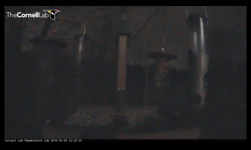

## MMM-CornellLabFeeder-Live

* Live video and sound from the Cornell University Lab Feeded in Ithica, NY USA.

Watch colourful birds closely on this live animal webcam of the Cornell Lab of Ornithology, 
housed in Sapsucker Woods Sanctuary, Ithaca, New York, USA. In this sanctuary, visitors can 
walk along more than 6 km of trails through forest and wetlands to try to see the 200 species 
of birds that can be found here.

## Examples
The module is a live stream. These are still shots, obviously.

  

## Installation

* `git clone https://github.com/mykle1/MMM-CornellLabFeeder-Live` into the `~/MagicMirror/modules` directory.

## Config.js entry and options

    {
    disabled: f,
    module: 'MMM-CornellLabFeeder-Live',
    position: 'bottom right',
    config: {
        height:"270px",
        width:"480px",
        useHeader: false,                // true if you want a header
        header: "",                      // Change in config file. useHeader must be true
        animationSpeed: 1000,            // fade speed
    }
},

